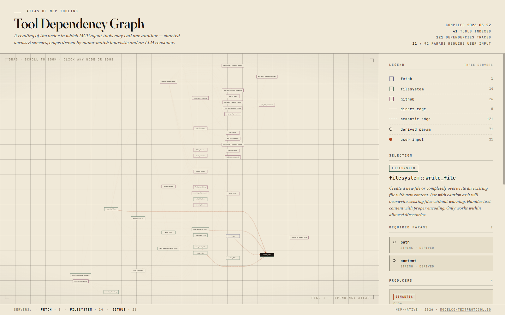

# MCP Tool Dependency Graph

A dependency-graph builder for [MCP](https://modelcontextprotocol.io) server tool catalogs. Given a set of MCP servers, it discovers which of their tools must run *before* others — for example: `list_directory` produces paths that `read_file` requires, or `fetch::fetch` returns content that `filesystem::write_file` consumes.

The graph captures two kinds of dependency:

- **Direct edges** — a producer tool's output field name-matches a consumer tool's required input. Identified by deterministic slug + verb heuristics.
- **Semantic edges** — a producer tool's output *semantically* satisfies a consumer's input even when names don't match (e.g., `list_directory` returns paths that `read_file` consumes). Identified by a per-consumer LLM pass.

**Cross-server edges are first-class.** Tools are namespaced as `<server>::<tool>` so identically-named tools across servers don't collide, and the heuristic + semantic passes both consider the full catalog, not one server at a time.

## Result at a glance

Default demo (filesystem + fetch + github MCP servers):

**41 tools · 121 edges (0 direct, 121 semantic) · 21 of 92 required params are user-supplied.**

The cross-server headline: `fetch::fetch → filesystem::write_file [content]` — fetch a URL, write the payload to disk — surfaced by the semantic pass. (Drop the github server from `config/servers.json` for a smaller 15-node graph if you don't have a `GITHUB_TOKEN`.)



## Install as a Skill

This repo is packaged as a [CreateOS Skill](https://nodeops.network/createos/skills). With the [`skills` CLI](https://github.com/NodeOps-app/skills), any AI coding agent can install and run the pipeline:

```bash
npx skills add https://github.com/<your-fork>/mcp-tool-deps --skill mcp-tool-deps
```

See [SKILL.md](SKILL.md) for the manifest that AI agents read.

## Run it

```bash
# Install
bun install

# Configure an LLM provider (any one works; auto-detected)
cp .env.example .env
# Edit .env and set ONE of:
#   ANTHROPIC_API_KEY   (Claude — recommended)
#   OPENAI_API_KEY      (GPT)
#   GOOGLE_API_KEY      (Gemini)
#   OPENROUTER_API_KEY  (routes to many; free-tier fallback works without credits)

# Choose which MCP servers to query (config/servers.json ships with sensible defaults)

# Fetch tool catalogs (spawns each MCP server over stdio and calls list_tools)
bun src/fetch.ts

# Build the graph (curate -> heuristics -> semantic -> merge)
bun src/build.ts

# View it (no build step, no server needed)
start viz/index.html        # Windows
open viz/index.html         # macOS
xdg-open viz/index.html     # Linux

# Optional: serve the viz on http://localhost:5173
bun src/serve.ts
```

## Configuration

### MCP servers — `config/servers.json`

```json
{
  "servers": [
    {
      "name": "filesystem",
      "command": "npx",
      "args": ["-y", "@modelcontextprotocol/server-filesystem", "."]
    },
    {
      "name": "fetch",
      "command": "uvx",
      "args": ["mcp-server-fetch"]
    }
  ]
}
```

Each server is spawned over stdio. Values of the form `$NAME` in a server's `env` are expanded from `process.env.NAME` at spawn time (so secrets like `GITHUB_TOKEN` come from your environment, not the config file).

Override the config path via `SERVERS_CONFIG=path/to/custom.json`.

### Tool allow-list — `config/allow-list.json` (optional)

If you want only a subset of each server's tools in the graph, drop in:

```json
{
  "filesystem": ["read_file", "write_file", "list_directory"],
  "github":     ["get_repository", "list_pull_requests"]
}
```

Missing file or empty array for a server means "include all tools from that server". Override the path via `ALLOW_LIST=path/to/custom.json`.

### LLM provider — environment variables

The semantic pass auto-detects which provider's API key is set. When multiple are set, the order is **Anthropic → OpenAI → Gemini → OpenRouter** (best-quality first). Override with:

- `LLM_PROVIDER=anthropic|openai|gemini|openrouter`
- `LLM_MODEL=<model>` — overrides the per-provider default (`claude-sonnet-4-5`, `gpt-4o-mini`, `gemini-2.5-flash`, or OpenRouter's `:free`-tier fallback chain).

## How it works

Six small TypeScript files, each one stage of the pipeline:

1. **`src/fetch.ts`** — spawns each MCP server in `config/servers.json` over stdio, calls `tools/list`, writes `data/raw/<server>.json`.
2. **`src/curate.ts`** — namespaces each tool's slug as `<server>::<tool>`, attaches its origin server, optionally filters by `config/allow-list.json` → `data/curated.json`.
3. **`src/heuristics.ts`** — emits `direct` edges via slug+verb heuristics. For an `<noun>_id` / `<noun>Id` consumer param, finds producer tools whose slug contains the noun and a producer verb (LIST/GET/SEARCH/READ/...). Cross-server matches allowed. → `data/edges.direct.json`.
4. **`src/semantic.ts`** — per-consumer LLM pass for semantic edges, with a per-consumer cache in `data/cache/semantic/`. The full catalog is presented (not one server at a time) so the LLM can find cross-server resolutions. → `data/edges.semantic.json`.
5. **`src/merge.ts`** — combines edges, dedupes on `(from, to, consumes)`, drops bogus edges (consumer-shaped "producers", and id-shaped self-required outputs), sets `user_supplied: true` on params with no producer → `graph.json` + `viz/graph.js`.
6. **`viz/index.html`** — single static page. Vanilla SVG + dagre layout, hand-rolled pan/zoom, dynamic per-server palette. Loads `graph.js` (no fetch / no CORS). No build step.

See [APPROACH.md](APPROACH.md) for design rationale and limitations.

## Status

- Working: multi-server MCP fetch via stdio, namespaced slugs, cross-server semantic edges, multi-provider LLM (Anthropic / OpenAI / Gemini / OpenRouter), dynamic viz.
- The slug-based direct heuristic is most effective for Composio-style `SCREAMING_SNAKE_CASE` slugs that name the noun they operate on (e.g., `GITHUB_GET_AN_ISSUE`). For typical MCP servers using `snake_case` verb-noun patterns (`read_file`, `list_directory`), nearly all edges come from the semantic pass.
- Not yet implemented: HTTP/SSE MCP transport (stdio only), multi-hop chain precomputation, output-schema-based direct matching (MCP servers don't expose output schemas).
